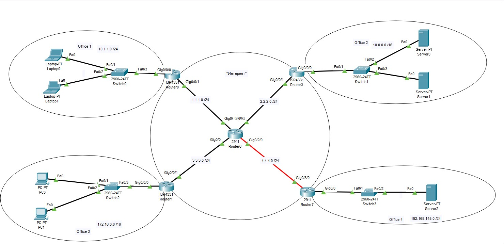
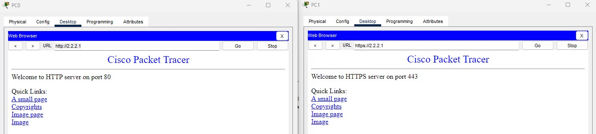
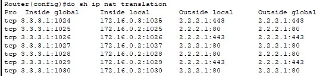
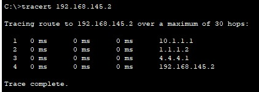
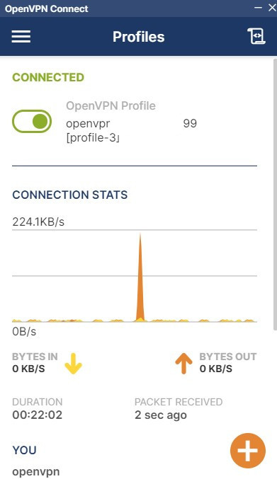

# Computer-networks-7
Компьютерные сети (семинары) Урок 7. NAT. GRE.

1. Настроить сеть согласно схеме в файле, где: 
— Office 1 — cеть 10.1.1.0/24 
— Office 2 — cеть 10.0.0.0/16 
— Office 3 — cеть 172.16.0.0/16 
— Office 4 — cеть 192.168.145.0/24 
— Где “Интернет” — там имитация Интернета с помощью OSPF, выберите сами публичные сети между роутерами.  
  
Задача 1. Настроить на Port Forwarding на сервера в Office 2. Server0 должен предоставлять HTTP по 80му порту, а Server1 должен предоставлять HTTPS по 443 порту. Странички должны быть разные.  
  
Задача 2. Настроить PAT в Office 3 для компьютеров, чтобы они выходили в интернет под одним публичным IP адресом на Router1. 

Предоставить скриншот открытых страниц по HTTP и HTTPS по публичному адресу Router3 в веб-браузере клиентов Office3 (с РС1 и РС0);
После чего предоставить вывод show ip nat translation c Router1.  

Задача 3. Связать сети Office 1 и Office 4 с помощью GRE. Предоставит трейс с Laptop0 до Server2.  

Задача 4. Доделать OpenVPN, если не успели. Предоставить скриншот публичного IP до и после подключения через VPN + скриншот вывода команды ip addr.
Учтите что в Yandex Cloud есть два нюанса: 
— если создавать прерываемую машину, то публичный адрес будет меняться после перезапуска; 
— на машине Yandex делает приватный IP, но одновременно в виртуализации создается Static NAT 1:1 в ваш публичный IP. 

